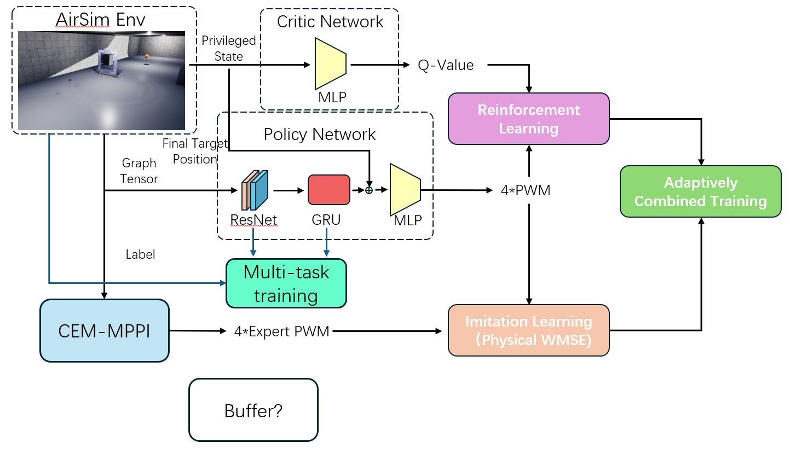
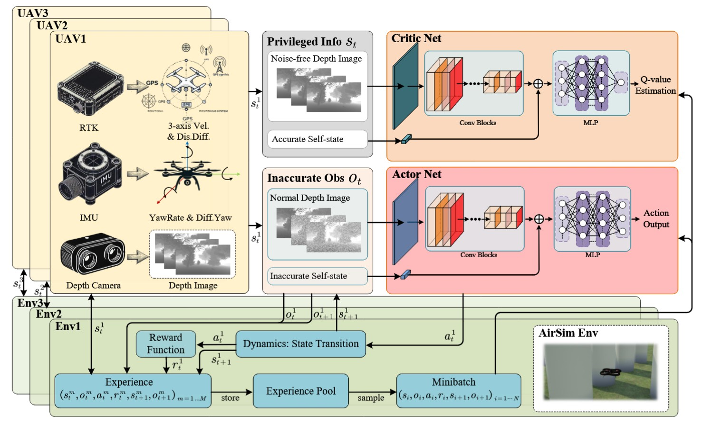
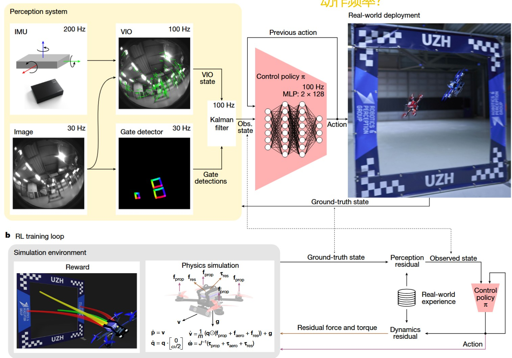
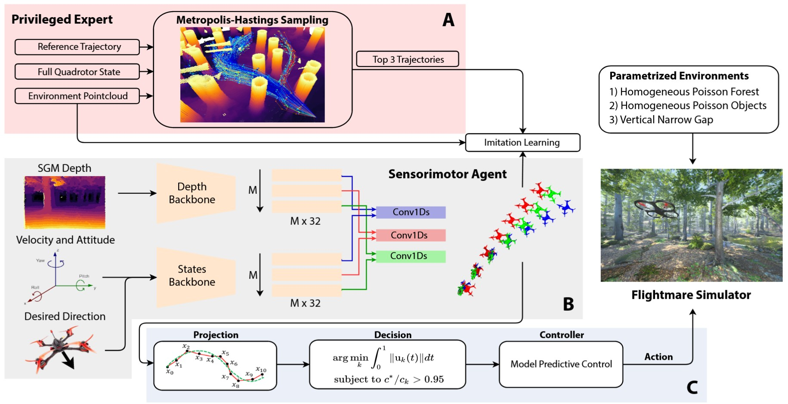
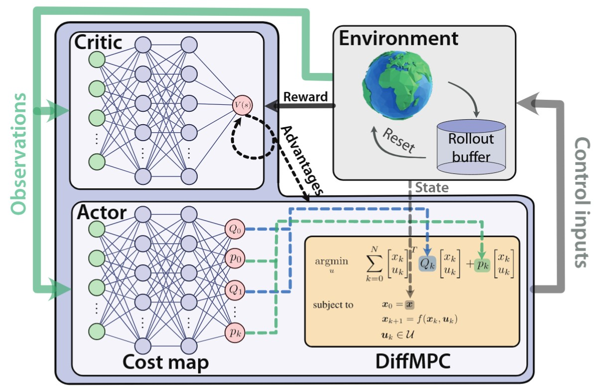
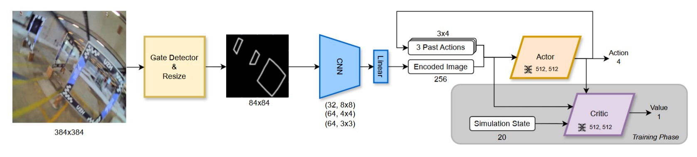

# Learning FPV End-to-end Guidance in Dynamic Enviroment from an Incompetent Teacher      
陈铮

------
## 脚本列表
| 文件名 | 描述 |
|---|---|
|**SACfD-SD**|主文件夹，也是最新文件夹，在单门环境下集成SACfD|
| `analytical_model_gpu.py` | 基于AirSim Simpleflight动力学的动力学预测模型 |
| `CEM_MPC.py` | 采用CEM技巧的MPC（MPPI）优化工具 |
| `config.py` | 存储算法几乎所有参数 |
| `env.py` | 算法与airsim交互的位置，向无人机、门框等输出移动指令并从airsim获取运动状态、图像等 |
| `main.py` | 算法主文件，与SAC更新、memory、env、mpc等部分交互 |
| `model.py` | 定义神经网络结构及前向传播 |
| `replay_memory.py` | 定义memory相关函数，包含RLmemory和DAggermemory |
| `sac.py` | SACfD算法位置，包含参数更新逻辑、模型存储与读取 |
| `test.py` | 代码测试文件 |
| `utils.py` | 一些共用函数 |
---
## 脚本细节
### analytical_model_gpu.py
使用 PyTorch 实现的无人机（四旋翼）动力学模拟器。   
**主要功能和特点**     
+ 批量处理： 整个模拟器被设计为可以在 GPU 上并行处理大量的模拟样本（由 num_samples 或 K 指定），效率很高。
+ 四元数运算： 包含了一套基于PyTorch的<u>可并行计算</u>四元数函数，用于处理三维旋转和姿态表示。
+ 核心动力学模型 (SimpleFlightDynamicsTorch)：该类构建了一个简化的无人机物理模型，考虑了质量、惯性、电机推力、气动阻力等因素。
它能根据给定的电机控制指令序列（PWM值），通过解算牛顿-欧拉方程，来预测无人机在一段时间DT内的飞行轨迹（位置、速度、姿态等）。 
+ 空气阻力采用box模型计算线阻力，忽略转动阻力。   
+ 模型包含了一个简单的低通滤波器来平滑电机PWM值。      
   
**输入与输出**   
调用simulate_horizon函数，输入初始状态批次、pwm序列批次与单步长度，输出状态序列批次构成的轨迹批次；每步预测调用self._dynamics_step函数。

### CEM-MPC.py  
本脚本实现**MPC算法**，具体采用的是**交叉熵方法（Cross-Entropy Method, CEM）+MPPI算法**作为其核心的优化器。    
**主要功能和逻辑**
+ CEM-MPC 控制器: 算法核心，用来为无人机计算出用于监督的控制指令。
+ 预测与优化:
    + 目标：控制器会根据预设的预测时域优化控制动作序列。
    + 优化流程： 在每个控制时刻，MPPI算法会：
      1. 随机生成大量可能的未来控制序列；
      2. 使用<u>无人机动力学模型 (analytical_model_gpu.py)</u>来预测执行这些控制序列后，无人机各自会飞出什么样的轨迹；
      3. 通过**代价函数（cost_function_gpu）**来计算每条预测轨迹的好坏
      4. 筛选出代价最低的、最好的几条轨迹（所谓的“精英轨迹”），并用它们来更新下一次随机采样的概率分布（均值和方差）
      5. 重复 b-d 步骤数次（n_iter），不断迭代，找到一个最优的控制序列。
+ 滚动时域: 算法只会执行找到的最优控制序列中的第一个动作，然后观察无人机的真实状态，再重新开始整个预测和优化过程，这是MPC对不准确模型具有鲁棒性的核心。
动态目标跟踪： 控制器能够跟踪动态变化的目标，比如移动的门，它会预测门在未来的位置，并以此作为优化目标。
+ GPU并行： 所有的轨迹预测和代价计算都在 GPU 上并行完成，这使得算法可以在短时间内评估大量可能性，优于传统MPC。      
   
**输入与输出**   
调用CEM_MPC类的step函数，输入初始状态、进度指数和已经过时间，输出当前最优动作（PWM值）

### env.py  
这个脚本定义了与AirSim仿真环境交互的接口类(env)。
**主要功能和设计思路**
+ 仿真环境封装: 将底层的AirSim API调用封装成高层的、类似OpenAI Gym的标准环境接口（reset 和 step 方法）。
+ 动态任务场景:
    + 移动门(_move_door): 通过函数控制门进行正弦移动；
    + 随机化初始状态: 在每次重置 (reset) 时，门的初始位置、运动相位以及最终目标点都会被随机化，以增强训练模型的泛化能力。
+ 多模态状态获取:
    + 物理状态 (get_drone_state): 从 AirSim 中获取无人机详细的物理状态，并整合成两种格式：一种是给 MPC 用的13维基础状态向量（位置、速度、姿态等），另一种是给强化学习网络用的、包含相对位置等信息的更复杂的状态向量。
    + 视觉输入 (get_img_sequence): 脚本的一个关键功能是能够连续捕获无人机的第一视角图像序列，并将这些图像预处理成适用于ResNet处理的张量格式。
+ 控制接口: step函数接收来自外部控制器（MPC和神经网络）的底层马达控制信号。
+ 奖励机制 (step): 为了引导强化学习模型的训练，设计了奖励函数，综合考虑了以下多个方面：
    + 进度奖励: 鼓励无人机朝向下一个目标点飞行。
    + 成本惩罚: 惩罚过大的控制动作、不稳定的飞行姿态（角速度过大）和过长的飞行时间。
    + 事件奖励/惩罚: 对成功穿过门或到达终点给予巨大奖励，对发生碰撞则给予巨大惩罚。
   
**输入与输出**   
调用step函数，输入PWM值，输出解析式无人机状态, 图像张量， Q网络状态, 奖励, 完成情况, 任务完成进度, 完成信息, 经过时间, 相对下一目标位置, 9D姿态, 相对下一目标速度, 无人机角速度

### main.py  
main.py是整个项目的主文件，将所有模块整合在一起，实现整体的训练方案。

**核心流程**
+ 初始化所有组件:
    + 从config.py加载所有超参数配置到字典内，并分配给不同模块。
    + 创建 env（AirSim环境）、CEM_MPC（专家控制器）和 SAC实例。
    + 准备多个经验回放池，用于存储不同来源和维度的训练数据。
      + Expert Memory: 存放专家示教轨迹数据，用于IL和RL
      + Exploration Memory：存放DAgger过程中实际执行动作数据，用于RL
      + DAgger Memory：大容量存放DAgger专家数据，用于IL
      + Recent Memory：小容量、快速更新存放DAgger专家数据，用于IL
+ 模仿学习训练策略：DAgger (数据集聚合)，DAgger方法结合了专家示教和智能体自主探索的优点。

+ 训练循环：
    + 每轮循环包含6个episode，其中第一个episode为专家示教，第2-6个episode为智能体探索
    1. 专家示教：脚本运行CEM-MPC来控制无人机。专家飞出的轨迹存储在“专家经验池”中。
    2. 监督学习与探索阶段：SAC 智能体开始自己控制无人机，在每一个step，系统会同时做两件事：
        + 让学生网络根据当前看到的图像，输出一个控制动作并在环境中执行，自主探索的经验（状态、自己的动作、奖励）被存入“探索经验池”。
        + CEM-MPC根据同一个状态输出一个专家动作，学生遇到的状态和专家给出的“正确答案”动作被分别存入一大一小两个“DAgger经验池”。
    3. 混合更新: SACfD智能体的神经网络会使用一个混合损失函数进行更新，该函数结合了：
        + 模仿学习损失: 鼓励学生的输出尽可能接近专家的“正确答案”。
        + 强化学习损失: 鼓励学生最大化从环境中获得的长期奖励。
    4. 重复1-3步
+ 评估与保存：训练会周期性地暂停，让学生网络在没有专家指导的情况下独立完成几轮任务，以评估其真实性能，表现最好的模型会被保存下来。

### model.py  
这个脚本定义了项目中使用的神经网络模型的架构，主要包括策略网络和价值网络，用于服务Soft Actor-Critic (SAC)算法训练。

**端到端策略网络结构**

+ 分层时空特征提取:
    + 空间特征: 使用一个**ResNet（残差网络）**作为图像编码器。对于输入的一组四帧连续图像帧，ResNet并行地从每一帧中提取出关键的空间特征。
    + 时序特征: 使用GRU按时间顺序处理从每帧图像中提炼出的特征向量。
+ 多任务学习与辅助监督:为了帮助网络更好地学习和理解物理世界，模型设计了两个辅助任务头：
    + ResNet 的辅助头从单张图片预测无人机的相对位置/姿态。
    + GRU 的辅助头从特征序列中预测无人机的相对速度/角速度。
+ 决策:
    + 由 GRU 输出的特征向量和归一化目标点位置拼接在一起并被送入一个标准的多层感知机（MLP），最终输出一个高斯分布的参数（均值和标准差），智能体从这个分布中采样生成最终的控制动作（四旋翼PWM值）。        
    + 
**价值评估网络结构**      
  + 标准SAC网络，由两个独立的 Q 网络构成，以提高训练的稳定性并避免对Q值的过高估计。    
  + 每个 Q 网络接收状态和动作作为输入，并输出一个标量值，用于评估在该状态下执行该动作的“好坏程度”（即预期回报）。

### replay_memory.py
定义了两种类型的经验回放池，用于存储、管理和采样训练数据。

**ReplayMemory (标准强化学习经验池)**      
+ 用途: 为标准的**强化学习**过程设计，存储智能体与环境交互的完整记录。
+ 存储内容: 每一条记录都是一个完整的“状态-动作-奖励-下一个状态”元组(s, a, r, s', done)。
+ 附加信息: 额外存储了用于多任务训练神经网络辅助任务的物理量标签，如真实的相对位置、姿态、速度等。      

**DAggerMemory (模仿学习/DAgger专用经验池)**      
+ 用途: 为模仿学习算法设计。
+ 存储内容: 存储的是某个状态下的专家动作以及相应的辅助任务标签。
+ 与前者的区别: 它不存储奖励（r）和下一个状态（s'）等信息，因为模仿学习的目标是直接学习从状态到专家动作的映射，这是一个监督学习问题，不需要奖励信号。

**共同特点**
+ 循环缓冲区: 两个类都使用了先进先出的固定容量的循环列表作为底层存储。
+ 随机采样: 都提供了一个 sample 方法，可以从缓冲区中随机抽取一批数据，并将其整理成适合神经网络输入的格式。

### sac.py
sac.py是整个SACfD (SAC from Demonstration)学习算法的核心与灵魂，它将模仿学习与强化学习相结合进行学习。

**概述**  
该脚本定义了 SAC 类，它扮演着无人机“大脑”的角色，主要负责：
+ 制定决策：根据视觉输入和其他状态信息，选择要执行的飞行动作。
+ 从经验中学习：通过更新其内部的神经网络来优化自身策略。
+ 自适应地融合两种不同的学习范式：
  + 模仿学习：通过模仿“专家”（即CEM-MPC控制器）的行为来学习。
  + 强化学习：目标是最大化从环境中获得的总奖励。
  + **创新点**：设计<u>动态权重系统</u>，根据智能体自身的**学习稳定性**和**不确定性**来自动调整学习策略。

**核心组件**    
+ 策略网络(self.policy)
    + 模型结构：采用了 model.py 中定义的ResNet+GRU+MLP架构;
    + 核心功能：接收一系列图像帧和其他状态信息作为输入，进而输出一个关于可能动作的概率分布。无人机的具体飞行动作从这个分布中采样得到的。
    + 多任务学习：该网络需要完成辅助任务，预测无人机的相对位置、姿态、速度和角速度。这种设计理论上迫使网络对视觉输入建立更符合物理规律的理解，从而为主控制任务提炼出更鲁棒、更有意义的特征。
+ 价值网络 (self.critic 和 self.critic_target)
    + 模型结构：采用标准的QNetwork，应用Double-Q 架构（即同时训练两个Q网络）与目标网络延迟更新自举方法。
    + 核心功能：用于评估动作的好坏，给定一个状态和在该状态下采取的动作，它会预测未来能获得的累计奖励期望（即“Q值”）。使用两个Q网络并取它们预测中的较小值，有助于稳定训练过程，并避免在强化学习中常见的对动作价值的过高估计问题。critic_target 是一个延迟更新的副本，为学习提供了一个稳定的目标。

**update_parameters方法**    
在这一方法中，全部五个网络利用来源于四个buffer的数据进行结合强化学习与模仿学习的SACfD学习。

**1. 数据准备**     
  + 函数从四个不同的经验回放池中采样数据：
  + expert_memory：来自MPC控制器的并不完美的示范数据。
  + exploration_memory：SAC智能体在环境中自主探索时收集的经验。
  + dagger_memory & recent_memory：用于DAgger方法，存储的是“状态-专家动作”配对，即智能体自己遇到的状态，但动作是MPC专家在该状态下会采取的动作。

这些数据随后被智能地组合成用于更新不同网络模块的特定批次。

**2. 评论家网络更新**     
评论家网络使用标准的SAC逻辑进行训练，利用专家数据和智能体的探索数据，学习准确地预测Q值。

**3. 策略网络更新（混合学习核心）**     
创新点之处，策略网络的更新使用由三部分组成的复合损失函数：
  + 模仿学习 (IL) 损失：将策略网络输出的动作与同一状态下MPC专家的动作直接进行比较，损失就是它们之间的差异，要求策略网络学习专家的“良好飞行习惯”。
  + 强化学习 (RL) 损失：标准的SAC策略目标。策略网络会尝试选择那些被评论家网络评为具有高Q值的动作（即能带来高未来回报的动作），要求智能体能够发现可能比专家更优的策略，或在专家未曾遇到的情况下也能良好表现。
  + 辅助任务损失：这是来自多任务学习的损失。网络对位置、速度等的预测会与模拟器提供的标签进行比较，要求视觉特征提取器学习到具有物理意义的表征。

**4. 自适应权重调节机制（创新点）**      
采用动态权重机制平衡模仿学习（IL）和强化学习（RL）的损失
+ 衡量不确定性与准确性：在每一步更新时，算法会计算两个关键指标：
    + Q值分歧 (Q-Disagreement)：两个评论家网络预测值之间的差异。高分歧意味着智能体对其当前策略的价值不确定。
    + 时序差分误差 (TD-Error，这里用Q_loss表示)：评论家网络损失的大小。高误差意味着Q网络的评估不准确。
+ **动态基准线**：这些原始指标会与其过去一段时间的演进基准线进行比较。
  + 仅仅看单次的TD-Error和Disagreement值是不够的，因为它们的绝对大小会随着训练进程变化。一个在初期看似很小的值，在后期可能就很大了。因此需要一个动态的参照物，也就是基准线 (baseline_td 和 baseline_dis)。
+ 动态基准线机制可以分解为以下几个步骤：
  1. 窗口期数据收集：系统不会对每一次的测量值做出反应，因为单次测量可能充满噪声，它使用一个由baseline_update_window参数定义的滑动窗口收集这个窗口内所有的 td_error和disagreement值。
  2. 计算候选基准线：在窗口期结束时，系统会计算这个窗口内所有收集到的值的平均值，作为“候选基准线”（candidate_td, candidate_dis），这代表了“最近这段时间”的平均学习状态。
  3. 基准线更新逻辑：基准线不会直接更新，而是单向更新。这个规则由baseline_update_gamma（例如0.7）控制：
    + 情况A：学习恶化（向上更新）：candidate_td > self.baseline_update_gamma
    + >如果当前窗口的平均误差程度比历史基准还高，说明智能体遇到了新的困难，学习变得更动荡了，此时无条件地将基准线的目标值更新为这个更高的候选值。
    + 情况B：学习显著进步（向下更新）：candidate_td < self.baseline_update_gamma * self.baseline_td
    + >如果平均误差程度远好于基准线（例如，低于基准的70%），标志着一个显著的、稳定的进步。此时，我们也更新基准线的目标值，将其降低到这个更低的候选值。
    + 情况C：学习略有进步（保持不变）
    + >如果误差程度只是略有下降（例如在基准的70%到100%之间），基准线的目标值将保持不变。
    + >这是单向更新的含义，它防止RL权重随着基准线持续小幅下降而下降。只有在确认大幅进步后才降低基准。这使得基准线更倾向于保持在较高的水平，避免RL权重过低。
  4. 平滑的基准线过渡：基准线的值并不会在窗口结束时立即“跳”到新的目标值，而是通过 delta_baseline_td 和 delta_baseline_dis，在下一个窗口期内，每一步都线性地、平滑地向目标值靠近，避免因基准线突变而导致的学习权重剧烈震荡。
  5. 计算最终权重：根据动态基准线，在每一次更新时评估当前的学习状态：
    + 归一化：用当前的 current_td_error 除以当前的 self.baseline_td 得到 norm_td。这个比值非常有意义：
        + norm_td > 1：说明网络学习情况差，超出了近期平均水平。
        + norm_td < 1：说明当前“尽在掌握”，比近期平均水平更稳定。
    + 计算RL权重：将归一化后的 norm_td 和 norm_dis 组合（取最大值），通过一个指数衰减函数 w_rl = torch.exp(-k_final * hybrid_metric) 计算出强化学习的权重。
        + 当学习动荡时（hybrid_metric > 1），w_rl 会变得非常小。
        + 当学习稳定时（hybrid_metric < 1），w_rl 会接近1。
    + 计算IL权重：模仿学习的权重就是 w_il = 1 - w_rl。

### utils.py
包含了一系列工具函数。
1. **Q网络更新**     
soft_update与hard_update函数用于管理主网络和目标网络之间的参数同步。
   + soft_update(target, source, tau)
     + 功能：软更新
     + 用途：这是SAC算法中更新**目标网络（Target Network）**参数的核心方法。目标网络的作用是为训练提供一个稳定的Q值目标，如果它更新得太快，训练会变得不稳定。
     + 工作原理：它以平滑融合的方式更新目标网络参数，公式为：目标网络参数 = (1 - tau) * 目标网络参数 + tau * 主网络参数。这里的 tau 是一个很小的值（例如 0.005），意味着每次只将主网络参数的一小部分更新到目标网络。
   + hard_update(target, source)
     + 功能：硬更新
     + 用途：在训练开始时，将主网络的参数复制到目标网络。
2. **基于物理的加权MSE损失函数 (项目创新点之一)**     
这两个函数是本项目在模仿学习部分的重要创新之一。
   + **weighted_mse_loss(y_pred, y_true)**   
     + 解决的问题：标准的均方误差（MSE）对所有样本一视同仁。专家数据中急转、急停等“关键”动作很少，模型可能会倾向于只学习普通动作，而忽略那些稀有但至关重要的关键动作，最终导致模型只会输出平均数据。
   + 工作原理：
     1. 计算当前批次（batch）内专家动作 y_true 的平均值。
     2. 为每个样本计算一个权重。一个专家动作离批次平均值越远，它的权重就越大。
     3. 用每个样本的原始MSE乘以其对应的权重，再计算加权后的平均损失。
   + 效果：这种机制强迫模型更加关注那些远离加权值的专家动作，防止它只学习动作分布的均值。
   + **physics_MSE(y_pred, y_true, weighted=False)**
     + 解决的问题：直接比较四个电机PWM值（即动作）的MSE无法准确反映真实的物理差异，这种不匹配可能会误导模型的学习。
     + 工作原理：它通过一个 conversion 辅助函数，将4个电机的PWM信号转换成更具物理意义的量：1个总推力和3个力矩（滚转、俯仰、偏航），它对模型的预测动作 y_pred 和专家的真实动作 y_true 都进行这种转换；然后，它在推力和力矩这个物理空间里计算MSE。
     + 它也集成了加权思想，对那些**动作幅度（平均PWM值）**偏离批次平均值的样本给予更高的权重。
   + 这个损失函数要求模型学习如何产生正确的推力和力矩。
3. **其他数学与工具函数**
+ create_log_gaussian: 计算一个值在给定高斯分布下的对数概率。在计算中直接使用对数可以避免因概率值过小导致的数值下溢问题，是SAC等算法中的标准操作。
+ logsumexp: 一个在数值上更稳定的方式来计算 log(sum(exp(x)))。直接计算 exp(x) 可能会因 x 过大而溢出，此函数通过数学技巧避免了这个问题。
+ map_value: 一个简单的线性映射函数，可以将一个值从一个范围 [a, b] 等比例地映射到另一个范围 [c, d]。这是一个通用的工具函数。
---
## 创新点归纳：

### 一：解决高速穿越动态门框场景下无人机端到端导航问题

**挑战性**
  + 非静态目标：智能体需要穿越的门本身在做参数随机的正弦运动。
  + 预测能力要求：智能体必须具备预测门未来位置的能力，才能规划出一条能够穿越的轨迹。
  + 高动态性：无人机自身的高速运动与门的动态运动相结合，对控制系统的实时性、精确性和鲁棒性要求更高。

### 二：结合模仿与强化学习的自适应策略学习框架
整个系统的顶层设计，利用**模型预测控制（CEM-MPPI）**作为“离线专家”，提供较高质量的控制序列。然后，通过强化学习+模仿学习训练神经网络来学习并进一步优化控制。    
**优势**      
+ 结合两者之长：模仿学习提供了良好的初始策略和稳定性，避免了强化学习初期的盲目探索；强化学习则赋予了智能体在专家未曾遇到的情况下进行泛化和超越专家的能力。
+ 解决了“冷启动”问题：相比于从零开始的强化学习，通过专家数据进行预热，极大地提升了学习效率和样本利用率。
+ DAgger范式应用：使用DAgger（数据集聚合）流程，即让学习中的智能体去探索环境，然后用专家来标记智能体遇到的新状态。
 
### 三：基于学习状态评估的自适应动态权重机制
主要具有独创性的部分，设计了能够自我评估学习状态并自动调整权重的系统。    
**核心思想**：通过两个代理指标，时序差分误差（TD-Error）和Q值分歧（Q-Disagreement），量化智能体学习过程的准确性和不确定性。    
**主要技术细节**     
  + 动态基准线：不比较指标的绝对值，而是将它们与一个缓慢变化且单向更新的动态基准线进行比较。这个基准线只在学习取得显著进步时才会降低，而在学习恶化时会立即跟上，这使得判断非常稳健。
  + 自适应权重计算：当Q网络准确时，系统提高强化学习（RL）的权重，鼓励智能体进行更多探索；当Q网络不准确时，系统提高模仿学习（IL）的权重，迫使智能体回归到更稳妥的专家策略。

### 四：融合时空信息的端到端控制网络与多任务学习监督
**核心思想**：采用ResNet+GRU结构分别提取视觉输入的空间特征和时间动态。    
**优势**：
  + 动态预测：利用GRU实现相对运动状态估计与预测。
  + 多任务学习：增加了辅助监督任务，要求ResNet辅助输出预测相对位姿，并要求GRU辅助预测相对速度/角速度。

### 五：基于物理的模仿学习损失函数 (Physics-Informed Loss)
**核心思想**：将模仿学习的损失函数转换到总推力与三轴力矩空间。    
**工作原理**：
  + 设计conversion函数将四个PWM信号转换为总推力和三轴力矩。
  + 损失函数计算的是模型产生的推力/力矩与专家产生的推力/力矩之间的差异，并集成了加权机制，对动作幅度偏离批次平均值的动作给予更高的惩罚权重。
---
## 可能需要进行的实验

### 定量实验主表格    
| 实验项目 | 备注 |任务成功率 | 穿越速度 | 
|:---:|---|---|---|
| Baseline | • 纯MPC • UZH的论文Learning High-Level Policies for Model Predictive Control |
| 完整模型| • 还在训练 |
| 纯模仿学习 | • 学习时把强化学习部分置零|
| 纯强化学习 | • 学习时把模仿学习部分置零 |
|移除多任务学习|• 学习时把辅助任务损失部分置零|
|验证物理加权损失函数？|• 模仿学习部分换成普通MSE|

### 定性实验
+ 对比SACfD训练模型飞行轨迹与纯模仿学习、纯强化、模型轨迹验证平滑+PWM值变化
+ ~~对ResNet、GRU输出特征向量可视化？~~
+ （定量）比较辅助输出头结果与标签，验证其对物理量提取能力
---
## 主图草稿

**参考论文主图**
+ Vision-Based Deep Reinforcement Learning of UAV Autonomous Navigation Using Privileged Information         

+ Champion-level drone racing using deep reinforcement learning         

+ Learning High-Speed Flight in the Wild

+ Actor-Critic Model Predictive Control

+ Demonstrating Agile Flight from Pixels  without State Estimation

---   
## 后续任务
1. 主算法调参确保可以稳定实现训练
  + 反复崩溃的时候反而可以训练，可能与on-policy有关？考虑：
    1. 进一步缩小buffer 
    2. 定期清空buffer相应调整混合学习权重
    3. 直接换PPO
    4. 其他调参，如reward设计
2. 做前述实验

---   

先写方法部分
